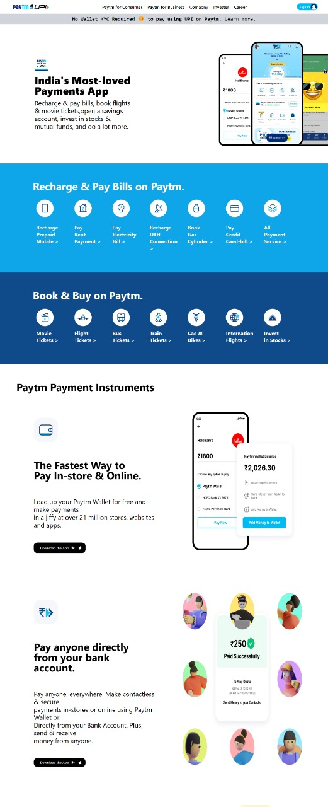

# Tailwind-Project-1-Paytm Home Page Template

## I have created home page clone of paytm website using HTML and Tailwind.

### I have not used a single line of CSS 3 for making this project.
### My Website is Fully Responsive , you can view in mobile , tab or desktop.

### For making my web page responsive mostly I used flext box and grid .

### It took approx 8 to 9 hours to completed 
